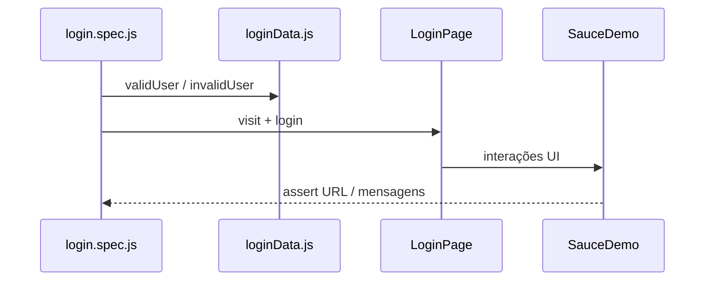
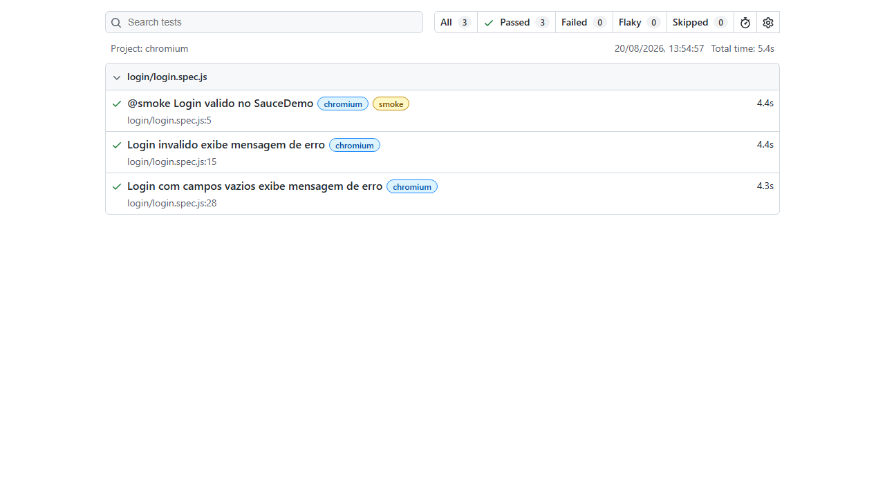
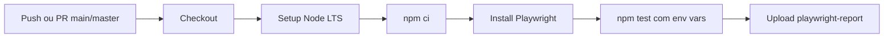

# Automação E2E — SauceDemo | Playwright

[](https://github.com/AzraelMartins/qa-automation-playwright/actions/workflows/playwright.yml)
[](https://nodejs.org/)
[](https://playwright.dev/)
[](https://developer.mozilla.org/pt-BR/docs/Web/JavaScript)
[](https://github.com/features/actions)

Projeto de portfólio que automatiza cenários críticos de login no [SauceDemo](https://www.saucedemo.com/), aplicando boas práticas de automação web: Page Object Model, separação de dados, tags de smoke e pipeline CI com artefatos de evidência.

**Autor:** [Azrael Martins](https://github.com/AzraelMartins) — QA Automation | Playwright | E2E

---

## Índice

- [Sobre o projeto](#sobre-o-projeto)
- [Stack tecnológica](#stack-tecnológica)
- [Arquitetura](#arquitetura)
- [Cenários de teste](#cenários-de-teste)
- [Pré-requisitos e setup](#pré-requisitos-e-setup)
- [Executando testes](#executando-testes)
- [Relatórios e evidências](#relatórios-e-evidências)
- [CI/CD](#cicd)
- [Estrutura do projeto](#estrutura-do-projeto)
- [Roadmap](#roadmap)
- [Contato e licença](#contato-e-licença)

---

## Sobre o projeto

| Item | Descrição |
|------|-----------|
| **Aplicação sob teste** | [SauceDemo](https://www.saucedemo.com/) — demo pública da Sauce Labs |
| **Escopo atual** | Fluxo de login (positivo, negativo e validação de campos) |
| **Fora de escopo** | Checkout, inventário, carrinho e testes de performance |
| **Tipo de teste** | E2E funcional, headless, Chromium |

Este repositório serve como referência técnica para recrutadores e revisores que queiram avaliar organização de código, cobertura de cenários e integração contínua em projetos de automação web.

---

## Stack tecnológica

| Tecnologia | Versão | Uso |
|------------|--------|-----|
| Node.js | LTS | Runtime |
| Playwright Test | 1.59 | Framework E2E |
| dotenv | 17.x | Credenciais via `.env` |
| GitHub Actions | — | CI automatizado |

Configurações em [`package.json`](package.json) e [`playwright.config.js`](playwright.config.js).

---

## Arquitetura



### Decisões técnicas

- **Page Object Model (POM)** — locators e ações encapsulados em [`pages/loginPage.js`](pages/loginPage.js); specs apenas orquestram e assertam.
- **Separação de dados** — credenciais válidas lidas do ambiente em [`data/loginData.js`](data/loginData.js); dados inválidos centralizados no mesmo módulo.
- **Locators semânticos** — `getByRole` e `[data-test]` para resiliência e alinhamento com acessibilidade.
- **Artefatos em falha** — trace, screenshot e vídeo configurados em [`playwright.config.js`](playwright.config.js):
  - `trace: on-first-retry`
  - `screenshot: only-on-failure`
  - `video: retain-on-failure`

---

## Cenários de teste

### Matriz de cenários

| ID | Cenário | Tag | Prioridade | Resultado esperado | Arquivo |
|----|---------|-----|------------|-------------------|---------|
| TC-01 | Login válido | `@smoke` | Alta | Redireciona para `/inventory.html` + "Products" visível | login.spec.js |
| TC-02 | Credenciais inválidas | — | Alta | Mensagem de erro + permanece na login | login.spec.js |
| TC-03 | Campos vazios | — | Média | "Username is required" + permanece na login | login.spec.js |

### Cenários em Gherkin

**TC-01 — Login válido (`@smoke`)**

```gherkin
Dado que estou na página de login do SauceDemo
Quando informo credenciais válidas e clico em Login
Então sou redirecionado para a página de produtos
  E vejo o título "Products"
```

**TC-02 — Login inválido**

```gherkin
Dado que estou na página de login
Quando informo usuário ou senha incorretos
Então vejo a mensagem "Username and password do not match..."
  E permaneço na URL de login
```

**TC-03 — Campos vazios**

```gherkin
Dado que estou na página de login
Quando clico em Login sem preencher os campos
Então vejo a mensagem "Username is required"
```

### Executar cenários específicos

```bash
# Apenas smoke
npx playwright test --grep @smoke

# Apenas suite de login
npx playwright test tests/login/

# Um cenário pelo título
npx playwright test -g "Login invalido"
```

---

## Pré-requisitos e setup

### Pré-requisitos

- Node.js em uma versão LTS
- npm

### Instalação

Instale as dependências e o navegador Chromium do Playwright:

```bash
npm install
npx playwright install chromium
```

Copie o arquivo de exemplo e ajuste se necessário:

**Windows (PowerShell ou CMD):**

```bash
copy .env.example .env
```

**Linux / macOS:**

```bash
cp .env.example .env
```

### Variáveis de ambiente

| Variável | Obrigatória | Exemplo | Descrição |
|----------|-------------|---------|-----------|
| `LOGIN_USERNAME` | Sim | `standard_user` | Usuário válido do SauceDemo |
| `LOGIN_PASSWORD` | Sim | `secret_sauce` | Senha válida do SauceDemo |

Exemplo de `.env`:

```env
LOGIN_USERNAME=standard_user
LOGIN_PASSWORD=secret_sauce
```

O arquivo `.env` não é versionado (está no [`.gitignore`](.gitignore)). As credenciais do SauceDemo são públicas e servem apenas para demonstração.

---

## Executando testes

| Comando | Descrição |
|---------|-----------|
| `npm test` | Headless, todos os specs |
| `npm run test:headed` | Com navegador visível |
| `npm run report` | Abre o relatório HTML |
| `npx playwright test --ui` | Modo UI interativo (debug) |
| `npx playwright test --debug` | Passo a passo com inspector |

Alternativa direta via Playwright:

```bash
npx playwright test
```

---

## Relatórios e evidências

Após a execução, abra o relatório HTML:

```bash
npm run report
```

O relatório é gerado em `playwright-report/`. Evidências de falha ficam em `test-results/`.



### O que é capturado em falha

| Artefato | Configuração | Local |
|----------|--------------|-------|
| Screenshot | `only-on-failure` | `test-results/` |
| Vídeo | `retain-on-failure` | `test-results/` |
| Trace | `on-first-retry` | `test-results/` |

Para inspecionar um trace:

```bash
npx playwright show-trace test-results/<pasta-do-teste>/trace.zip
```

No GitHub Actions, o relatório fica disponível como artifact **playwright-report** na aba [Actions](https://github.com/AzraelMartins/qa-automation-playwright/actions/workflows/playwright.yml) (retenção de 30 dias).

---

## CI/CD



Pipeline definido em [`.github/workflows/playwright.yml`](.github/workflows/playwright.yml):

- **Triggers:** push e pull request nas branches `main` e `master`
- **Retries:** 2 tentativas no CI ([`playwright.config.js`](playwright.config.js))
- **Credenciais:** injetadas via `env` no workflow (não hardcoded no código)
- **Artefato:** relatório HTML publicado automaticamente após cada execução

---

## Estrutura do projeto

```text
.
├── .github/workflows/playwright.yml  # Pipeline CI no GitHub Actions
├── .env.example                      # Modelo de credenciais
├── data/loginData.js                 # Massa de dados e leitura do .env
├── docs/images/                      # Screenshots para documentação
├── pages/loginPage.js                # Page Object da tela de login
├── tests/login/login.spec.js         # Specs E2E de login
├── playwright.config.js              # Config global (baseURL, reporters, artefatos)
├── package.json                      # Scripts e dependências
└── .env                              # Credenciais locais (não versionado)
```

| Pasta / arquivo | Responsabilidade |
|-----------------|------------------|
| `tests/` | Specs E2E — cenários e asserções |
| `pages/` | Page Objects — locators e ações |
| `data/` | Massa de dados e leitura de `.env` |
| `.github/` | Pipeline de integração contínua |

Os diretórios `playwright-report/` e `test-results/` são gerados durante os testes e não fazem parte do código-fonte.

---

## Roadmap

- [ ] Cenários de logout e `locked_out_user`
- [ ] Suite de inventário / carrinho
- [ ] Execução multi-browser (Firefox, WebKit)
- [ ] Integração com relatório Allure ou notificação no Slack
- [ ] Paralelismo e sharding no CI

---

## Contato e licença

- **GitHub:** [AzraelMartins](https://github.com/AzraelMartins)
- **Repositório:** [qa-automation-playwright](https://github.com/AzraelMartins/qa-automation-playwright)
- **Licença:** [ISC](package.json) — uso livre para portfólio e referência técnica
